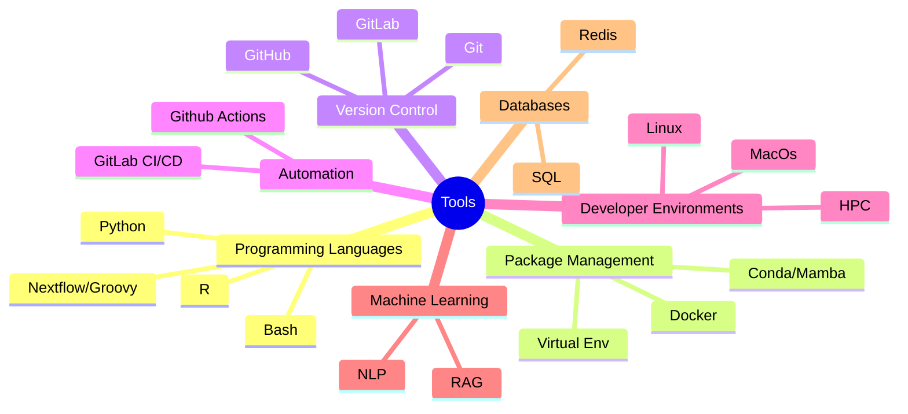

# Hi there 👋, I'm Alexey Gorbunov

## Bioinformatician | ML/NLP-enthusiast | ~~Vibe~~ Coder | Professional 🤡
I specialize in NGS data analysis and optimizing workflows to improve efficiency.

### Languages, Tools and skills:

As a bioinformatician and a curious person in general, I work with a diverse range of tools. Below are the key technologies I have used over the past year:

