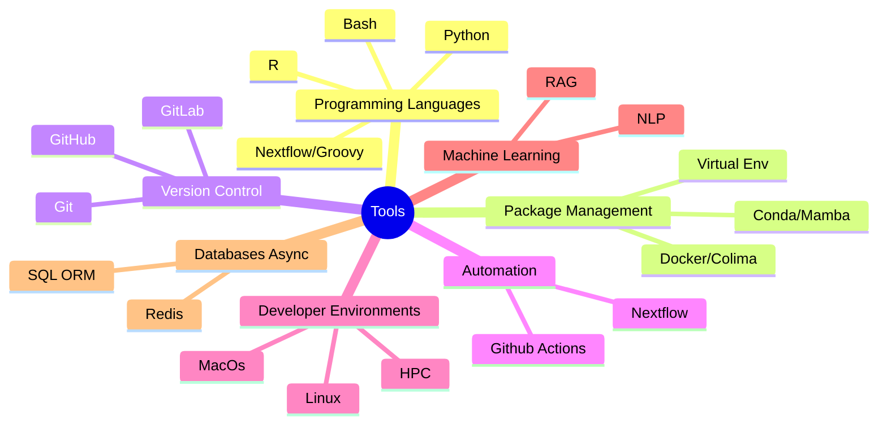

# Hi there 👋, I'm Alexey Gorbunov

## Bioinformatician | ML/NLP-enthusiast | ~~Vibe~~ Coder | Professional 🤡

### At the State Research Center of Virology and Biotechnology VECTOR
I specialize in NGS data analysis and optimizing workflows to improve efficiency. Over the past year, I have developed extensive Groovy/Nextflow code to meet the center’s local requirements. Additionally, I have explored and implemented various ML/NLP tools and protocols to stay up to date with the latest technological advancements.

### Languages, Tools and skills:

As a bioinformatician and a curious person in general, I work with a diverse range of tools. Below are the key technologies I have used over the past year:

